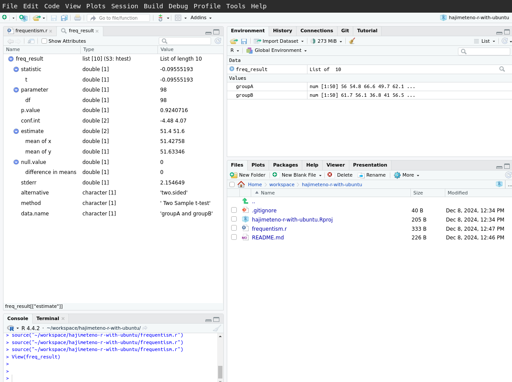

# hajimeteno-r-with-ubuntu

## Setup
1. [The Comprehensive R Archive Network](https://cran.rstudio.com/)
2. [RStudio Desktop - Posit](https://posit.co/download/rstudio-desktop/)
  - `sudo apt install ./***.deb`
  - `rstudio`

